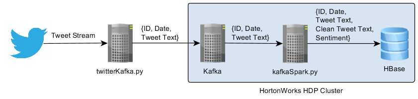

# Sentiment Analysis on Twitter Streaming Data

**More information coming soon.**

## Solution architecture


## Servers


### Server Configuration
HDP Ambari: 1 vCPU, 3.75 GB

HDP Node 1: 2 vCPUs, 13 GB

HDP Node 2: 2 vCPUs, 13 GB

Python Server: 1 vCPU, 3.75 GB

## Configuration
### Kafka
The library kafka-python version 1.4.2 was used because both versions 1.4.3 and 1.4.4 seems to have some issues when using group IDs.

Creating the new Kafka Topic
```
/usr/hdp/current/kafka-broker/bin/kafka-topics.sh --create --zookeeper hdp-h91v.c.twitterml.internal:2181,hdp-fw2c.c.twitterml.internal:2181 --replication-factor 1 --partitions 1 --topic twitter
/usr/hdp/current/kafka-broker/bin/kafka-topics.sh --list --zookeeper hdp-fw2c.c.twitterml.internal:2181
```
### HBase
Starting Thrift server so we can use the HappyBase library:
```
/usr/hdp/current/hbase-master/bin/hbase-daemon.sh start thrift -p 9090 --infoport 9095
```

Creating a new table called "twitterSentiment" inside HBase shell:
```
create 'twitterSentiment', 'date', 'text', 'tokens', 'sentiment'
list
scan 'twitterSentiment'
```
## Notes
The Dataset used for the Logistic Regression model training can be found at: http://help.sentiment140.com/for-students
